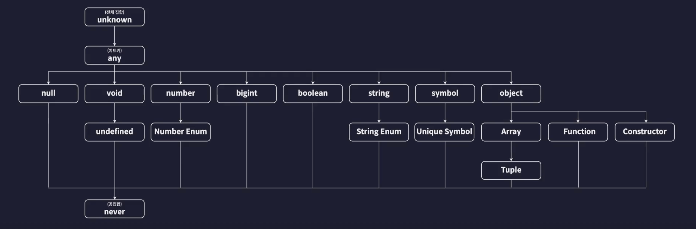

# 기본타입
: 타입스크립트가 자체적으로 제공하는 타입 = 내장타입  


# 폴더 생성 (복습)
- `init npm`으로 node.js 패키지 초기화 하기
- node.js의 내장 기능들에 대한 타입 정보를 제공하는 typesnodes 패키지 설치  
  `npm i @types/node`
- 컴파일러 옵션을 설정하기 위해 [tsconfig.json] 파일 생성

  
```json
{
  "compilerOptions": {
    "target": "ESNext",
    "module": "ESNext",
    "outDir": "dist",
    "strict": true,
    "moduleDetection": "force"
  },
  "ts-node": {
    "esm": true
  },
  "include": ["src"]
}
```


- package.json 파일에 type 추가

```json
{
  "name": "1-basic-types",
  "version": "1.0.0",
  "main": "index.js",
  "type": "module",
  "scripts": {
    "test": "echo \"Error: no test specified\" && exit 1"
  },
  "author": "",
  "license": "ISC",
  "description": "",
  "dependencies": {
    "@types/node": "^22.14.1"
  }
}
```

